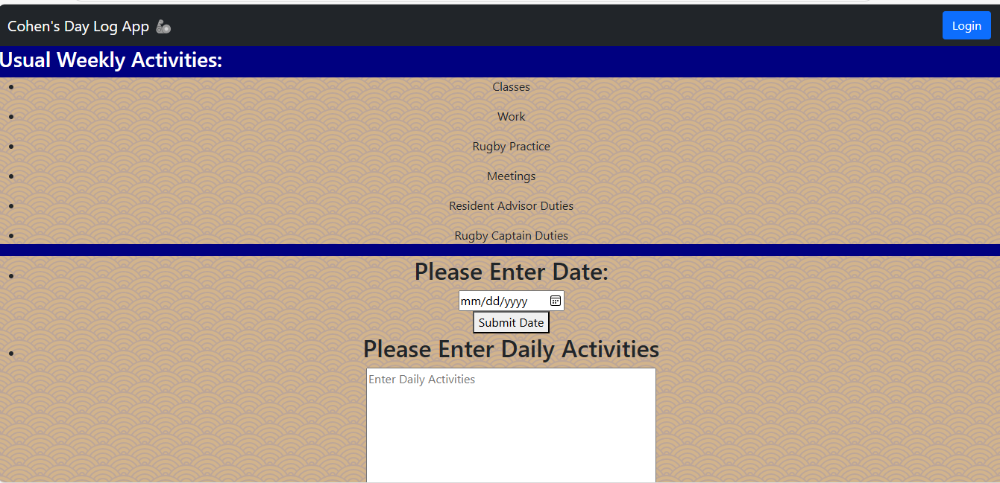
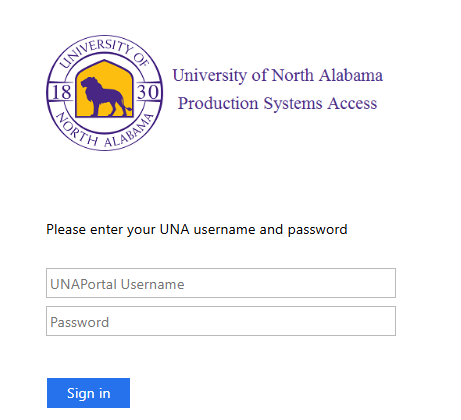

# Cohen's Day Log🦭

<p align="left">
  <h2>Authorship🖊️</h2>
   <b>Author:</b> Cohen Cantrell
</p>

<p align="left">
  <h2>Attribution👾</h2>
  * https://getbootstrap.com/docs/5.0/components/modal/<br>
  * https://codepen.io/barrycumbie/pen/LEPmgdB<br>
  * https://github.com/barrycumbie/jubilant-garbanzo-easy-read<br>
  * https://www.w3schools.com/tags/att_input_type_date.asp<br>
  * https://getbootstrap.com/docs/4.0/components/card/<br>
</p>

<p align="left">
  <h2>A User Story🧔</h2>
  <p>As a <strong>average human who does things and uses websites</strong><br> I want <strong>to be able to log my daily activities</strong><br> so that <strong>I can look back on the good times and see what all I do in a day.</strong></p>
</p>

<p align="left">
<h2>Narrative📖</h2>
  I created this application to keep track of what I do everyday. I wanted to keep a kinda virtual diary, so I can go back and see what I did. I wanted to do this so I could be nostalgic if I wanted to or more importantly, I can go back and see if I did things that I was supposed to do. I decided to create this app for my first web dev project. It went well the first time, so i decided to bring it back for my last web dev project.<br>

Here is an example of what my app looks like:<br>
<br>

Here is a little example of my HTML code that makes my navbar:
```HTML
<nav class="navbar navbar-expand-lg navbar-dark bg-dark">
  <div class="container-fluid">
    <a class="navbar-brand" href="#">Cohen's Day Log App 🦾</a>

<button id="login" type="button" class="btn btn-primary" data-bs-toggle="modal" data-bs-target="#exampleModal">
  Login
</button>

<div class="modal fade" id="exampleModal" tabindex="-1" aria-labelledby="exampleModalLabel" aria-hidden="true">
  <div class="modal-dialog">
    <div class="modal-content">
      <div class="modal-header">
        <h5 class="modal-title" id="exampleModalLabel">Please Enter Username and Password</h5>
        <button type="button" class="btn-close" data-bs-dismiss="modal" aria-label="Close"></button>
      </div>
      <div class="modal-body">
        <input type="text" id="username" class="form-control mb-2" placeholder="Username">
        <input type="password" id="password" class="form-control mb-2" placeholder="Password">
      </div>
      <div class="modal-footer">
        <button type="button" class="btn btn-secondary" data-bs-dismiss="modal">Close</button>
        <button type="button" class="btn btn-primary">Enter</button>
      </div>
    </div>
  </div>
</div>
</div>
    </div>
  </div>
</nav>
```

Here is also an example of what insired my Bs5 modal login:<br>
<br>
</p>

<p align="left">
<h2>Code I Think is Cool</h2>
I think this code from my project is pretty cool. It is a JSON file and 
```JSON
{ "logData" : 
    [
        {   
            "date" : "2/10/2025",
            "note" : "Got up at 8:15. Went to my RA office hours from 8:30 to 10:30 AM. I went to class from 12:00 PM to 2:45 PM. I was then on RA duty for the rest of the day. I went to bed around 11:00."
        },
        {   
            "date" : "2/11/2025",
            "note" : "Got up at 8:30 AM. Went to my three classes for the day. Classes ended by 3:15 PM. Went to work at 4:00 PM and got off at 11:00 PM. Went to bed at 12:00 AM."
        },
        {
            "date" : "2/12/2025",  
            "note" : "Got up at 11:00 AM. Went to my classes from 12:00 PM to 2:45 PM. I then came back to the dorms and wroked on some projects. I went to bed around 10:30 PM."
        },
        {
            "date" : "2/13/2025",  
            "note" : "Got up at 8:30 AM. Went to my three classes for the day. Came back to the dorms around 3:30 PM. I went to rugby practice from 7:00 pm to 9:00 PM. I came back, took a shower, and went to bed around 11:30 PM."
        },
        {
            "date" : "2/14/2025",  
            "note" : "Today was Valentine's day. Me and Rachel took a day trip to Chattanooga to see the Tennessee Aquarium. We arrived in the city at around 11:00 AM. We were then at the aquarium for about 3 hours. We then headed on our way back and went to dinner at Longhorn. I went to bed around 2:00 AM."
        },
        {
            "date" : "2/15/2025",  
            "note" : "I got up and went to work at 10:00 AM. I got off at 7:00 PM and went back to the dorms. I then worked on some schoolwork and went to bed around 10:00 PM."
        },
		{
            "date" : "2/16/2025",  
            "note" : "I got up around 11:00 AM. I spent all day working on assignments. I then met up for dinner with Rachel. I went to bed around 10:30 PM."
        }
    ]
}
```

<p align="left">
<h2>Future Ideas</h2>
<a href="https://github.com/ccantrell2/devGeorgeProject/issues/1#issue-3027860371" target="_blank">Future Ideas Issue</a>
</p>


